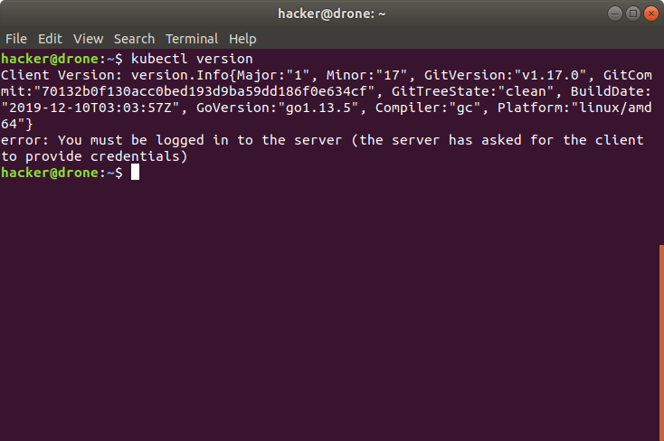
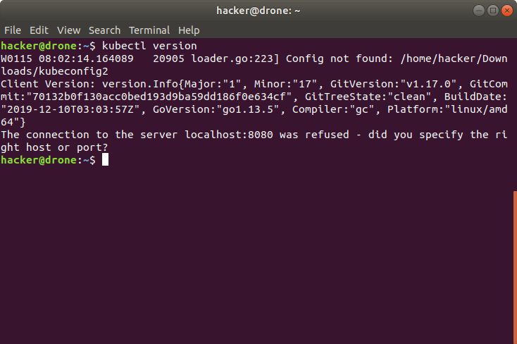
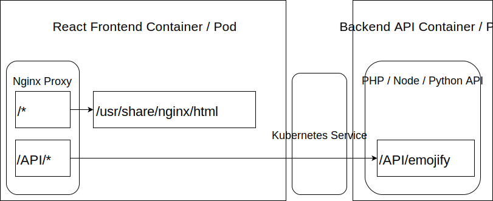

# Deploy To Kyma

## Download the Kubeconfig file

Kubernets comes with a powerful api, which is often accessed via the [kubectl cli](https://kubernetes.io/docs/reference/kubectl/kubectl/). Kubectl is already installed on your virtual machines, so no need to do anything here. 

In order to access your Kubernetes environment, kubectl requires configuration often referred to as kubeconfig. Your Kyma CLuster comes with its own kubeconfig that you can download from the Kyma UI. A detailled description of how to do this is provided [here](https://kubernetes.io/docs/reference/kubectl/kubectl/).

### Troubleshooting

If you are not logged in you will get an error like the one below. If this is the case, then just download a new kubeconfig file from the ui and it should work again.

If your KUBECONFIG environment variable is not set correctly you will see something like on the screenshot below:

To analyze this further the following commands are helpful:

* Print the directory where the kubeconfig file should be located: `echo $KUBECONFIG`
* Read the file: `cat $KUBECONFIG`

## Use your Namespace

To separate workspaces for teams we will use Kubernetes [Namespaces](https://kubernetes.io/docs/concepts/overview/working-with-objects/namespaces/). Each team can gets one namespace. The namespace will be provided to you with the rest of the credentials.

Issue the following command to default all actions via the cli to your teams namespace: `kubectl config set-context --current --namespace=<insert-namespace-name-here>`. This needs to be repeated whenever you download a new KUBECONFIG file.

### Troubleshooting

Should you observe any weird behaviour, issue the following command: `kubectl config get-contexts`. This will show the current default namespace assigned.

## The Scenario

In this scenario we are going to deploy two applications to Kyma. First of all a Backend that exposes a REST API. For this there are sample implementations available in: 

* [PHP](../conuhacks5-php)
* [Python](../conuhacks5-python)
* [Node.js](../conuhacks5-node)

Send there will be a [web frontend](../conuhacks5-react) which is leveraging the API exposed to render emojis for a given name. This frontend is running behind an [nginx](https://hub.docker.com/_/nginx) "webserver". This webserver will serve the react frontend and direct any api calls to the backend. The below graphic shows a conceptul view of that:

Details regarding creation and deployment of the containers are shared in the respective sections:

* [Backend API](api/)
* [Web Frontend](ui/)
