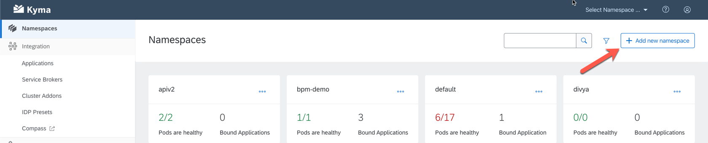
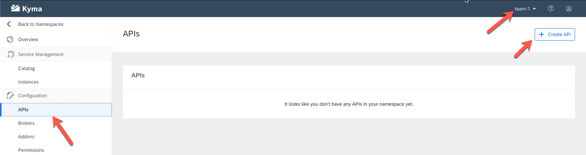
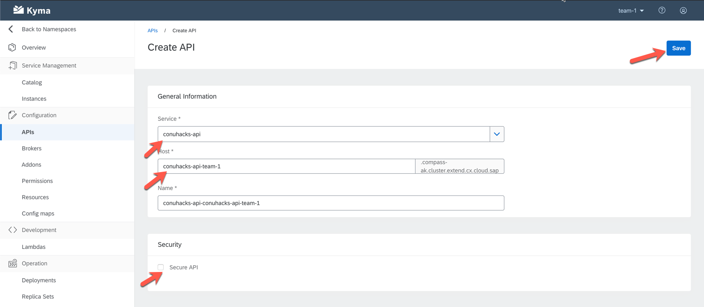
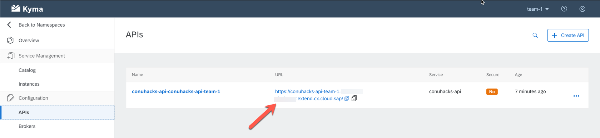

# Deploy To Kyma

## Download the Kubeconfig file

Kubernets comes with a powerful api, which is often accessed via the [kubectl cli](https://kubernetes.io/docs/reference/kubectl/kubectl/). Kubectl is already installed on your virtual machines, so no need to do anything here. 

In order to access your Kubernetes environment, kubectl requires configuration often referred to as kubeconfig. Your Kyma CLuster comes with its own kubeconfig that you can download from the Kyma UI. A detailled description of how to do this is provided [here](https://kubernetes.io/docs/reference/kubectl/kubectl/).

### Troubleshooting

If you are not logged in you will get an error like the one below. If this is the case, then just download a new kubeconfig file from the ui and it should work again.

If your KUBECONFIG environment variable is not set correctly you will see something like on the screenshot below:

To analyze this further the following commands are helpful:

* Print the directory where the kubeconfig file should be located: `echo $KUBECONFIG`
* Read the file: `cat $KUBECONFIG`

## Create a Namespace

To separate workspaces for teams we will use Kubernetes [Namespaces](https://kubernetes.io/docs/concepts/overview/working-with-objects/namespaces/). Each team can get one or many namespaces. They can be created via the cli or the ui. 

The namespace value (i.e. the prefix) is assigned to you by the SAP Organization team.

In the UI navigate to your cluster and select the `Add new Namespace` Button.

ALternatively you can also use the cli with the following command: `kubectl create namespace <your-team-value>` (replace `<your-team-value>` with the value given to you).

Issue the following command to default all actions via the cli to your teams namespace: `kubectl config set-context --current --namespace=<insert-namespace-name-here>`. This needs to be repeated whenever you download a new KUBECONFIG file.

### Troubleshooting

Should you observe any weird behaviour, issue the following command: `kubectl config get-contexts`. This will show the current default namespace assigned.

## Create the Kubernetes Deployment

After pushing the container image to [Docker Hub](https://hub.docker.com/), it is time to deploy it to the cloud / kubernetes. To do so we will leverage the Kubernetes [Deployment](https://kubernetes.io/docs/concepts/workloads/controllers/deployment/) API. A template is already provided as [deployment.yaml](deployment.yaml). It has all the basic constructs in place to deploy the PHP and Python Sample Application. In order to deploy your application, all you need to do is change the docker image referenced from `image: andy008/conu-php:0.0.1` to your own and then issue the command:

`kubectl apply -f deployment.yaml`

Then wait for the deployment's [Pod](https://kubernetes.io/docs/concepts/workloads/pods/pod/) to be running. To check this, issue the following command: `kubectl get pods -w`

### Troubleshooting

Should you observe errors, you can use the describe command for the deployment (and the derrived pod) to get an idea about the error: `kubectl describe deployment conuhacks-api`.

## Create the Kubernetes Service

Kubernetes [Services](https://kubernetes.io/docs/concepts/services-networking/service/) are an abstract way to expose an application running on a set of Pods as a network service. 

To expose your API as a service, just issue the following command: `kubectl apply -f service.yaml`

The yaml file does not require any editing.

## Expose the Kyma API

Kyma comes with an [API Gateway](https://kyma-project.io/docs/components/api-gateway/). This lets you expose services running inside your Kubernetes cluster to the outside world. Although this is possible through the cli, the recommendation is to go through the Kyma UI. 

To do so, navigate to the namespace that you created earlier, click on the API menu item and then select `Create API`:

Now you can select the service created earlier and expose it to the internet. This is illustrated below. 

To ensure no collisions exist, follow the below naming scheme:

| Field         | Value           |
| ------------- |:-----------------------------------------:| 
| Service      | conuhacks-api      |
| Host | `conuhacks-api-<team-prefix>` | 
| Secure API | disabled |

After saving you should see the same as below. To test the API, just click on the hightlighted link:

The API Object is based on [Istio Virtual Services](https://istio.io/docs/reference/config/networking/virtual-service). Should you require a more advanced configuration, this can be manipulated as well. But be careful, this can get complex and error prone. Talk to your coach first.

