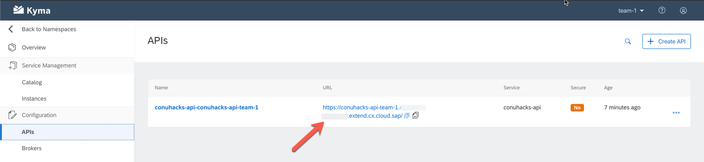

# Deploy API Backend to Kyma

## Build and Push Docker Images

Each backend and frontend includes a dedicated `Dockerfile` specifying a sequence of steps required to build and package the application into a Docker image. To read about Dockerfile instructions used in this workshop, see [additional resources](../../additional-resources/DOCKER.md).

To build the Docker image and store it locally, issue the following command, substituting each value with you own:
```
docker build -t DOCKER_ID/IMG_NAME:TAG DOCKERFILE_PATH
```

Once the image is built, push it to Docker Hub using the same image name and tag:
```
docker push DOCKER_ID/IMG_NAME:TAG
```

For example:
```
docker build -t andy008/conu-php:0.0.1 .
docker push andy008/conu-php:0.0.1
```

## Create the Kubernetes Deployment 

After pushing the container image to [Docker Hub](https://hub.docker.com/), it is time to deploy it to the cloud / kubernetes. To do so we will leverage the Kubernetes [Deployment](https://kubernetes.io/docs/concepts/workloads/controllers/deployment/) API. A template is already provided as [deployment.yaml](deployment.yaml). It has all the basic constructs in place to deploy the PHP and Python Sample Application. In order to deploy your application, all you need to do is change the docker image referenced from `image: andy008/conu-php:0.0.1` to your own and then issue the command:

`kubectl apply -f deployment.yaml`

Then wait for the deployment's [Pod](https://kubernetes.io/docs/concepts/workloads/pods/pod/) to be running. To check this, issue the following command: `kubectl get pods -w`

### Troubleshooting

Should you observe errors, you can use the describe command for the deployment (and the derrived pod) to get an idea about the error: `kubectl describe deployment conuhacks-api`.


## Create the Kubernetes Service

Kubernetes [Services](https://kubernetes.io/docs/concepts/services-networking/service/) are an abstract way to expose an application running on a set of Pods as a network service. 

To expose your API as a service, just issue the following command: `kubectl apply -f service.yaml`

The yaml file does not require any editing.

## Expose the Kyma API

Kyma comes with an [API Gateway](https://kyma-project.io/docs/components/api-gateway/). This lets you expose services running inside your Kubernetes cluster to the outside world. Although this is possible through the cli, the recommendation is to go through the Kyma UI. 

To do so, navigate to the namespace that you created earlier, click on the API menu item and then select `Create API`:


Now you can select the service created earlier and expose it to the internet. This is illustrated below. 

To ensure no collisions exist, follow the below naming scheme:

| Field         | Value           |
| ------------- |:-----------------------------------------:| 
| Service      | conuhacks-api      |
| Host | `conuhacks-api-<team-prefix>` | 
| Secure API | disabled |


After saving you should see the same as below. To test the API, just click on the hightlighted link:




The API Object is based on [Istio Virtual Services](https://istio.io/docs/reference/config/networking/virtual-service). Should you require a more advanced configuration, this can be manipulated as well. But be careful, this can get complex and error prone. Talk to your coach first.